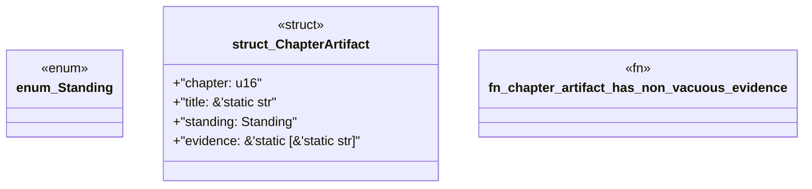

# `book/src/listings/058-58-reference-tests.rs`

Source SHA-256: `2b0fe74cfdd165caa35c7cd67779665986a109a599cab5a43d5edf534b374901`

## Dependencies

- None observed.

## Standing

- Structural parse: `ALIVE`
- Runtime behavior: `UNKNOWN`
