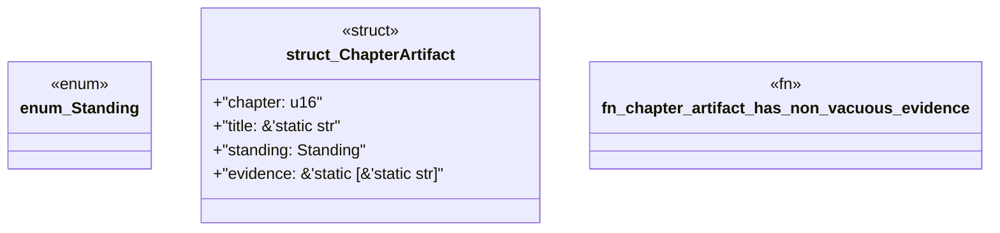

# `book/src/listings/059-59-verbatim-test-reuse.rs`

Source SHA-256: `610b7dfa541884af7dc2e52ff2455cca563fd1a1d9897e271d265463fc7c3fac`

## Dependencies

- None observed.

## Standing

- Structural parse: `ALIVE`
- Runtime behavior: `UNKNOWN`
