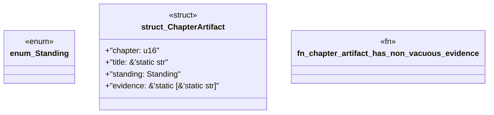

# `book/src/listings/060-60-read-only-reference-fixtures.rs`

Source SHA-256: `1fa37869bb6398e50cf68b56c124ca8e9735283ee45e17c74bb9773eef6e3d65`

## Dependencies

- None observed.

## Standing

- Structural parse: `ALIVE`
- Runtime behavior: `UNKNOWN`
