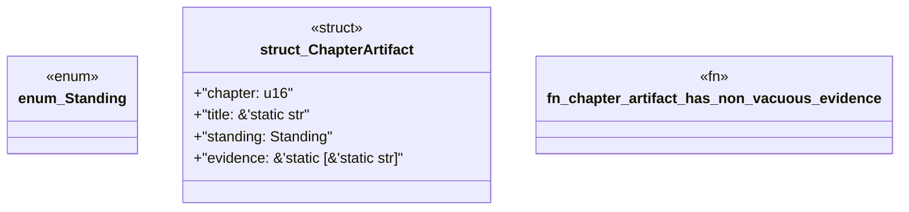

# `book/src/listings/062-62-reference-digests.rs`

Source SHA-256: `c16cbd02b563ddc2d5c22168393e922c9bc20060b45090fd6e3bf90097b4f424`

## Dependencies

- None observed.

## Standing

- Structural parse: `ALIVE`
- Runtime behavior: `UNKNOWN`
