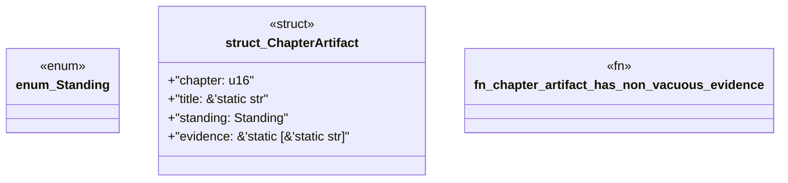

# `book/src/listings/063-63-disclosed-corrective-divergence.rs`

Source SHA-256: `19f5720f37a2c86b7eb82c14d7a01c2ed69c4e4c81ce0e1f80c76054499e57ee`

## Dependencies

- None observed.

## Standing

- Structural parse: `ALIVE`
- Runtime behavior: `UNKNOWN`
