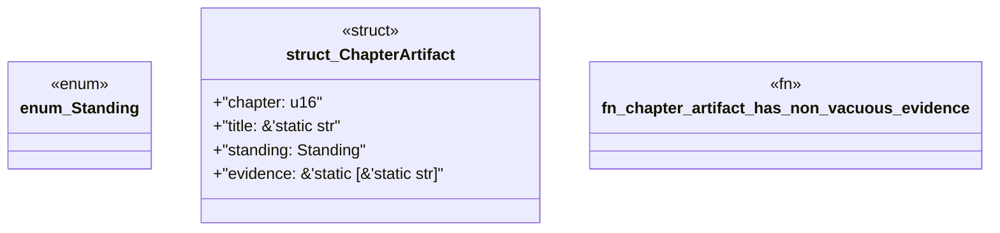

# `book/src/listings/064-64-when-the-reference-is-defective.rs`

Source SHA-256: `e5300b5c9e42db0146c31b75c55e5f75b3f94d94beb7b8f460f073b26f9a3c1e`

## Dependencies

- None observed.

## Standing

- Structural parse: `ALIVE`
- Runtime behavior: `UNKNOWN`
