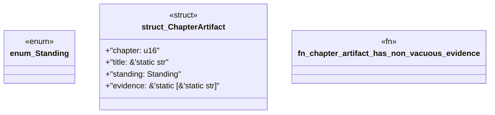

# `book/src/listings/121-121-generate-modules-not-fragments.rs`

Source SHA-256: `c7489b26aa5980d46cff14b73c83eacd33be41fb8503450f42697d0fdfa03f79`

## Dependencies

- None observed.

## Standing

- Structural parse: `ALIVE`
- Runtime behavior: `UNKNOWN`
