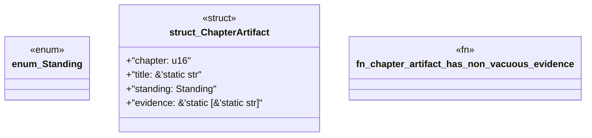

# `book/src/listings/122-122-generate-public-types.rs`

Source SHA-256: `85b913fcec973340faf7596d4182244fa97ba3872d87aee4a476c5970451953f`

## Dependencies

- None observed.

## Standing

- Structural parse: `ALIVE`
- Runtime behavior: `UNKNOWN`
