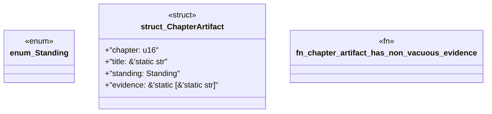

# `book/src/listings/123-123-generate-enums-and-variants.rs`

Source SHA-256: `40f60d8300251108bd4fc4cc23d59655b9318ac9c14dd5e095477d109b4958c5`

## Dependencies

- None observed.

## Standing

- Structural parse: `ALIVE`
- Runtime behavior: `UNKNOWN`
