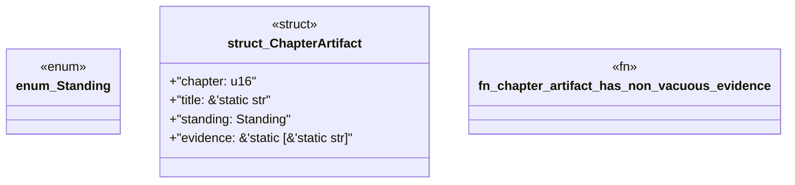

# `book/src/listings/124-124-generate-structs-and-fields.rs`

Source SHA-256: `8ee094aa241228a58ade0693f4ef68c2bd6a103310010fb5dc149c123e9db681`

## Dependencies

- None observed.

## Standing

- Structural parse: `ALIVE`
- Runtime behavior: `UNKNOWN`
