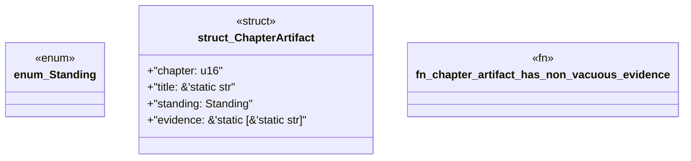

# `book/src/listings/125-125-generate-trait-boundaries.rs`

Source SHA-256: `cef09fba00cd606f1c65b01fc5af8c386b75d069ae4b7eabd6a3b99caea0a94c`

## Dependencies

- None observed.

## Standing

- Structural parse: `ALIVE`
- Runtime behavior: `UNKNOWN`
