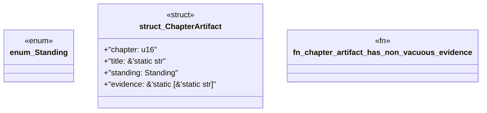

# `book/src/listings/126-126-generate-functions.rs`

Source SHA-256: `7a37f527f338010f127bdd39a62cd20e6e5aa3bf73d9b8b667c05ee638ad4cd5`

## Dependencies

- None observed.

## Standing

- Structural parse: `ALIVE`
- Runtime behavior: `UNKNOWN`
