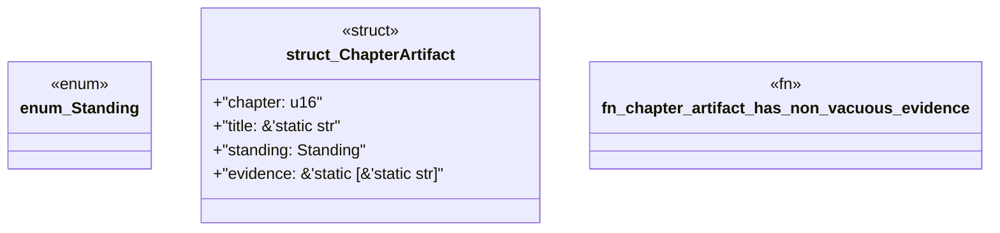

# `book/src/listings/127-127-generate-typestate.rs`

Source SHA-256: `bb812150b58db44757fc6067ddd477da48c63e9d21f3a707c906b46b0317a310`

## Dependencies

- None observed.

## Standing

- Structural parse: `ALIVE`
- Runtime behavior: `UNKNOWN`
