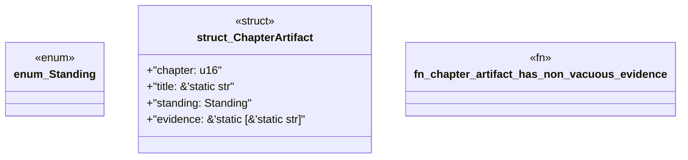

# `book/src/listings/128-128-generate-no-std-code.rs`

Source SHA-256: `3e46914739e9834fd6dacb543428f99eae2489ee577421fe925d44e755124021`

## Dependencies

- None observed.

## Standing

- Structural parse: `ALIVE`
- Runtime behavior: `UNKNOWN`
