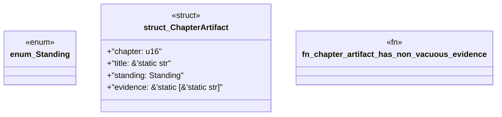

# `book/src/listings/129-129-forbid-unsafe-code.rs`

Source SHA-256: `0a3774fb68624cb89a8151d0c0bc7d19a8c8e77f1c3ca91a630837879a3c89e5`

## Dependencies

- None observed.

## Standing

- Structural parse: `ALIVE`
- Runtime behavior: `UNKNOWN`
