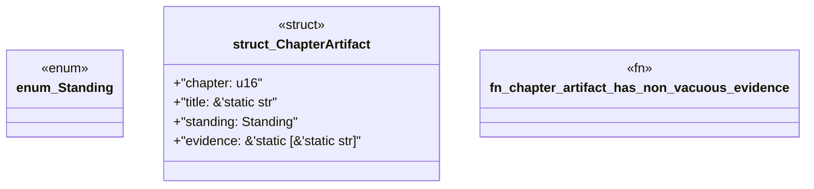

# `book/src/listings/130-130-generate-module-aggregation.rs`

Source SHA-256: `c872d796e0df22832e9d98e0f9e4d2c2513ed0fffa6bd1a7a452d2b66b07608e`

## Dependencies

- None observed.

## Standing

- Structural parse: `ALIVE`
- Runtime behavior: `UNKNOWN`
