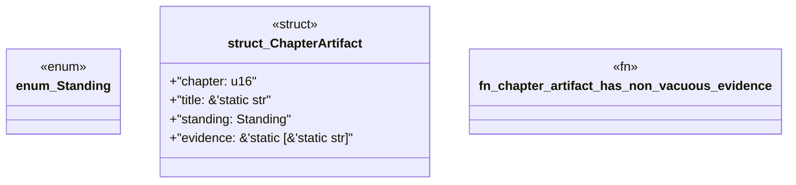

# `book/src/listings/132-132-generate-multiple-crates.rs`

Source SHA-256: `96cfaa135c1d5a7c0f355b713fba5a33feac12725254a430e86b4de8c0a38f01`

## Dependencies

- None observed.

## Standing

- Structural parse: `ALIVE`
- Runtime behavior: `UNKNOWN`
