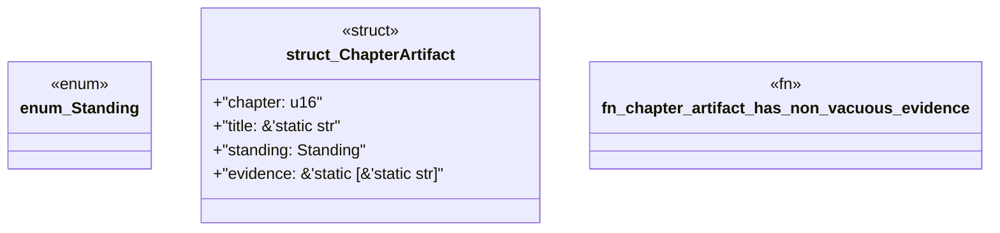

# `book/src/listings/133-133-generate-c-abi-surfaces.rs`

Source SHA-256: `a376e0c01f30fc3e709f87f70a345cdb20bc1d7da8d3b2d383f5e65279de2ad3`

## Dependencies

- None observed.

## Standing

- Structural parse: `ALIVE`
- Runtime behavior: `UNKNOWN`
