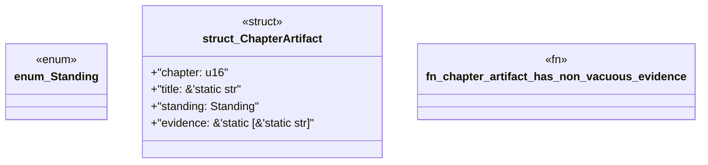

# `book/src/listings/134-134-generate-webassembly-surfaces.rs`

Source SHA-256: `3d3c4e5e27afc0f3d7618bcb2e28d242196091255731000cc6796654e9728495`

## Dependencies

- None observed.

## Standing

- Structural parse: `ALIVE`
- Runtime behavior: `UNKNOWN`
