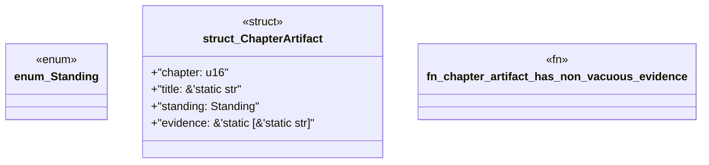

# `book/src/listings/135-135-why-generated-code-needs-generated-proof.rs`

Source SHA-256: `6d06d8a9203d286ed9828ccfb41561bcaebb7ff9be19ba4be444bb78a293922f`

## Dependencies

- None observed.

## Standing

- Structural parse: `ALIVE`
- Runtime behavior: `UNKNOWN`
