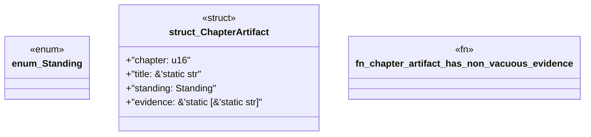

# `book/src/listings/136-136-avoid-tautological-tests.rs`

Source SHA-256: `5a8b855e88fd550eb10647478978c187e78dffd2952c0d7c9d22ab739be3acd2`

## Dependencies

- None observed.

## Standing

- Structural parse: `ALIVE`
- Runtime behavior: `UNKNOWN`
