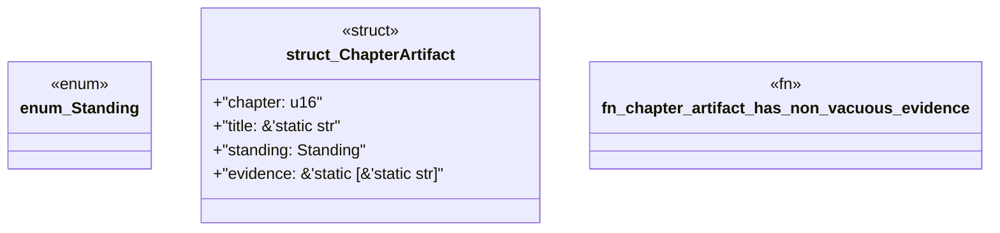

# `book/src/listings/137-137-independent-expected-values.rs`

Source SHA-256: `b737c938621d8437bf004f383811474cc6215723abffbbb937ee904e5ae1046d`

## Dependencies

- None observed.

## Standing

- Structural parse: `ALIVE`
- Runtime behavior: `UNKNOWN`
