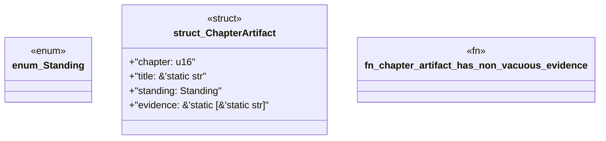

# `book/src/listings/138-138-chicago-tdd.rs`

Source SHA-256: `84b31af1d8bbf52bae02e7605ea8053ba03f0f855cc3f333f339c44cf15def23`

## Dependencies

- None observed.

## Standing

- Structural parse: `ALIVE`
- Runtime behavior: `UNKNOWN`
