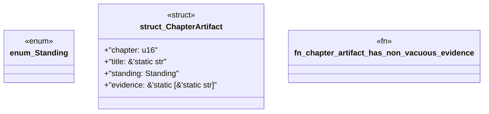

# `book/src/listings/139-139-compile-time-proof-through-signatures.rs`

Source SHA-256: `91e903c8ec225c58672d295aa43adc0f88745ec59e2c0f2e52739fd0799bf0dc`

## Dependencies

- None observed.

## Standing

- Structural parse: `ALIVE`
- Runtime behavior: `UNKNOWN`
