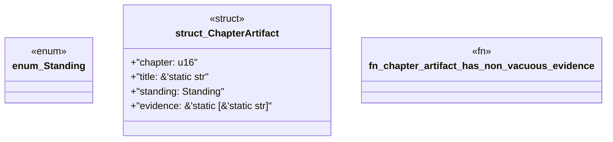

# `book/src/listings/140-140-runtime-behavioral-proof.rs`

Source SHA-256: `5b6cc132c6bc981c1000078ce1de61bbfa5353a44031fa54da119ab7d32f77fc`

## Dependencies

- None observed.

## Standing

- Structural parse: `ALIVE`
- Runtime behavior: `UNKNOWN`
