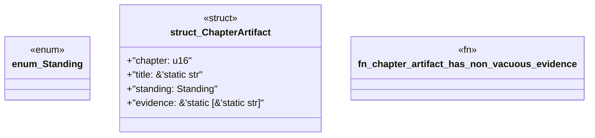

# `book/src/listings/141-141-verbatim-reference-tests.rs`

Source SHA-256: `e5a4dbd151cca623bfff17d6decafb0af15a8a98f50c1913fb67d2f1576051c6`

## Dependencies

- None observed.

## Standing

- Structural parse: `ALIVE`
- Runtime behavior: `UNKNOWN`
