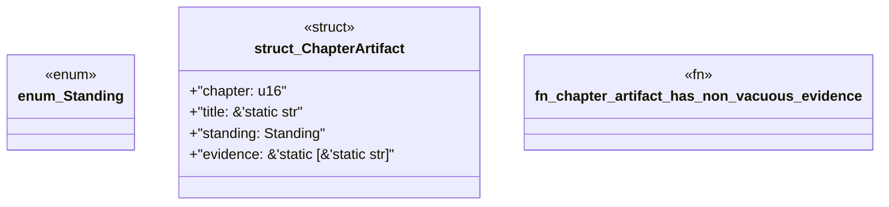

# `book/src/listings/142-142-unit-tests-in-generated-modules.rs`

Source SHA-256: `fb961cedb2a41a5af66c36321f6d5594f9c89922afe9c27dbd5f4e824f8f6efd`

## Dependencies

- None observed.

## Standing

- Structural parse: `ALIVE`
- Runtime behavior: `UNKNOWN`
