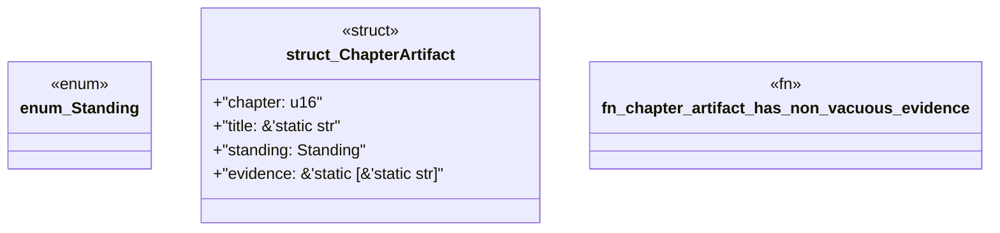

# `book/src/listings/143-143-integration-tests-in-real-consumers.rs`

Source SHA-256: `d38cf07f2c62ec91ab8f5378096e7a396431842d9d1cdefa5ca277f9ab4b0064`

## Dependencies

- None observed.

## Standing

- Structural parse: `ALIVE`
- Runtime behavior: `UNKNOWN`
