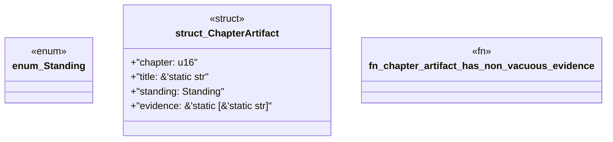

# `book/src/listings/145-145-first-sync-green.rs`

Source SHA-256: `ecf79bcbe29e9af040e3c84885e30cdd54948f1b82c21260148c3cc8b6c71ab0`

## Dependencies

- None observed.

## Standing

- Structural parse: `ALIVE`
- Runtime behavior: `UNKNOWN`
