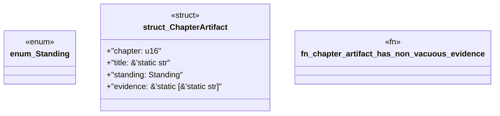

# `book/src/listings/146-146-proof-failure-as-jidoka.rs`

Source SHA-256: `2feb73fd89ca40ef052c8cf86557de9ac6f6881761ee689b81d54451bc829928`

## Dependencies

- None observed.

## Standing

- Structural parse: `ALIVE`
- Runtime behavior: `UNKNOWN`
