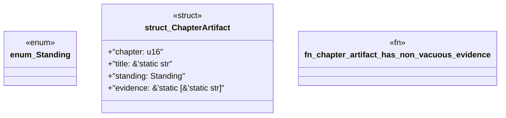

# `book/src/listings/147-147-mutation-tests.rs`

Source SHA-256: `d1af74bb9fc046584df614b5ef0539d74a86ab06ba85693013462dee9f46debc`

## Dependencies

- None observed.

## Standing

- Structural parse: `ALIVE`
- Runtime behavior: `UNKNOWN`
