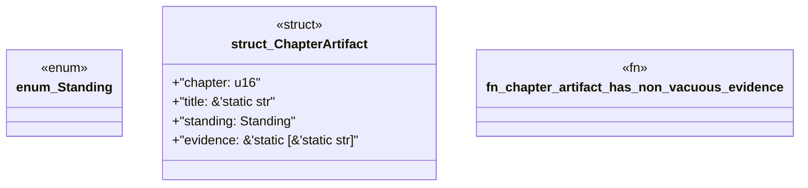

# `book/src/listings/149-149-a-pack-without-a-consumer-is-not-finished.rs`

Source SHA-256: `59aceb1e5e751ad7c7e2302a84cbbfdcf2015a219efdd9de59c214550a39b5b2`

## Dependencies

- None observed.

## Standing

- Structural parse: `ALIVE`
- Runtime behavior: `UNKNOWN`
