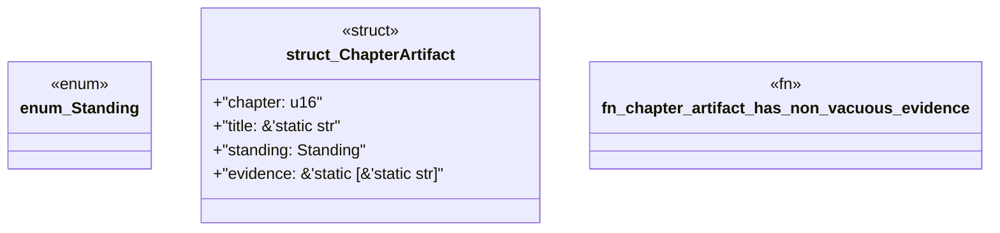

# `book/src/listings/152-152-source-law-inputs.rs`

Source SHA-256: `66feeaef2867b123ba3159ec35fea90f34fc5918c751515867902b3f90c396b4`

## Dependencies

- None observed.

## Standing

- Structural parse: `ALIVE`
- Runtime behavior: `UNKNOWN`
