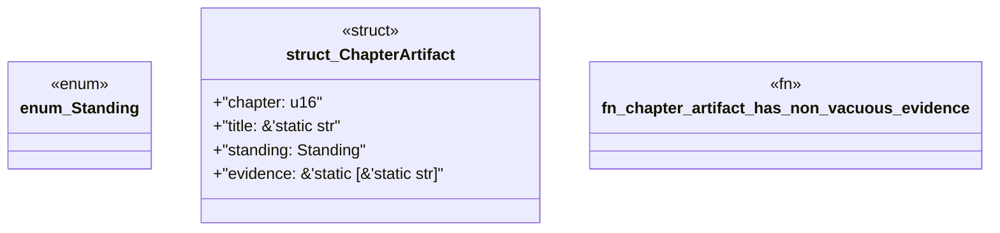

# `book/src/listings/153-153-generated-output-mounts.rs`

Source SHA-256: `f07791a2a845d440984f8c9a7b069fe1afb645efa6868981d529609619a65709`

## Dependencies

- None observed.

## Standing

- Structural parse: `ALIVE`
- Runtime behavior: `UNKNOWN`
