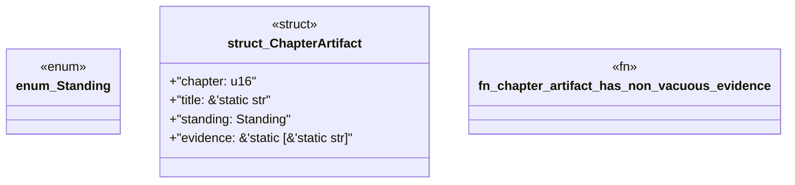

# `book/src/listings/154-154-module-wiring.rs`

Source SHA-256: `5a61dad188aa31bcb7926e3a049e82ec1d03d68a8b69e6a4c42952cfbcc1e934`

## Dependencies

- None observed.

## Standing

- Structural parse: `ALIVE`
- Runtime behavior: `UNKNOWN`
