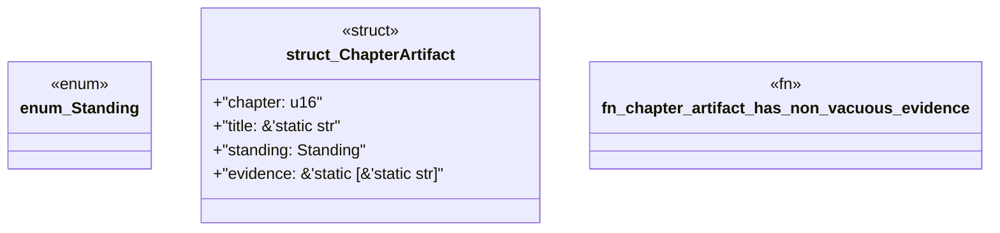

# `book/src/listings/155-155-engine-owned-aggregators.rs`

Source SHA-256: `6604a3d3820be5b59454a600fb87fc43ac8255b92f30523ec3531b0ff1be6629`

## Dependencies

- None observed.

## Standing

- Structural parse: `ALIVE`
- Runtime behavior: `UNKNOWN`
