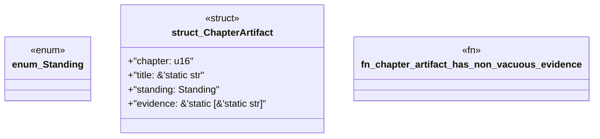

# `book/src/listings/156-156-zero-knowledge-consumer-setup.rs`

Source SHA-256: `8baaf1eecc206e5086d48de2750723066d42faa8fdcc100a6fab2d67f8e031b8`

## Dependencies

- None observed.

## Standing

- Structural parse: `ALIVE`
- Runtime behavior: `UNKNOWN`
