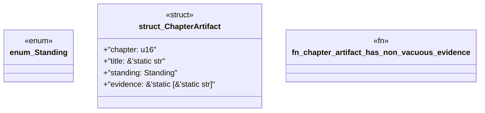

# `book/src/listings/159-159-test-the-consumer.rs`

Source SHA-256: `fbad1f15007103a19e1e4d7d6ac61dbd89a16250c9099a2c9eec14f341f32426`

## Dependencies

- None observed.

## Standing

- Structural parse: `ALIVE`
- Runtime behavior: `UNKNOWN`
