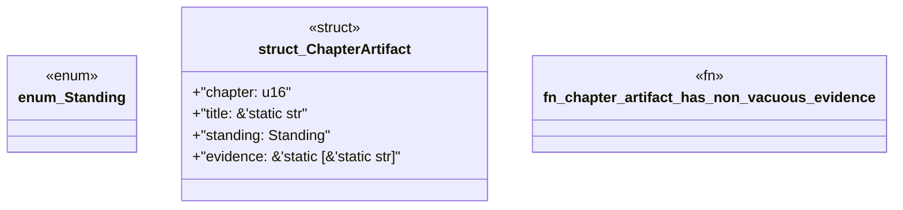

# `book/src/listings/160-160-consume-the-same-pack-twice.rs`

Source SHA-256: `790452c2eb0caa28a19b1e6aadd9bb5765f79559d8b982a1e66435c0aa3bbff6`

## Dependencies

- None observed.

## Standing

- Structural parse: `ALIVE`
- Runtime behavior: `UNKNOWN`
