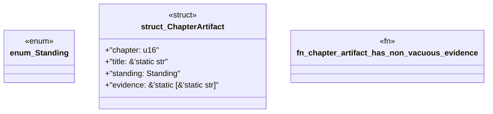

# `book/src/listings/161-161-the-union-graph.rs`

Source SHA-256: `e9a877cc30c31428dcf676a4e536343d1433ca69a9421421e69c7998638c812e`

## Dependencies

- None observed.

## Standing

- Structural parse: `ALIVE`
- Runtime behavior: `UNKNOWN`
