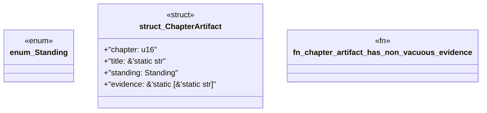

# `book/src/listings/162-162-namespace-safety.rs`

Source SHA-256: `12a1d78dd0c4e21e830289cda2e4aee66556258b83dcad9bd5813af79c1f01d8`

## Dependencies

- None observed.

## Standing

- Structural parse: `ALIVE`
- Runtime behavior: `UNKNOWN`
