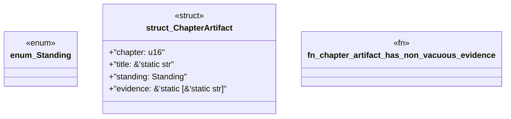

# `book/src/listings/164-164-local-individuals-under-shared-classes.rs`

Source SHA-256: `03b05896dd1fed65a00b0a6c80c752f8798d0e1b738b48b8858204243af1ad8c`

## Dependencies

- None observed.

## Standing

- Structural parse: `ALIVE`
- Runtime behavior: `UNKNOWN`
