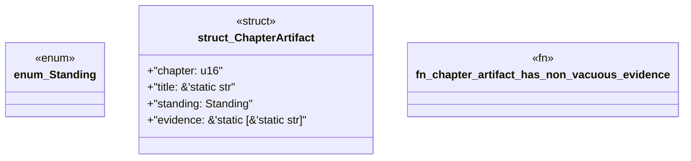

# `book/src/listings/166-166-output-path-collisions.rs`

Source SHA-256: `3dbb28fab14757242b1cff02749f365bf78baf33d41994c376e4c63baa5d93ad`

## Dependencies

- None observed.

## Standing

- Structural parse: `ALIVE`
- Runtime behavior: `UNKNOWN`
