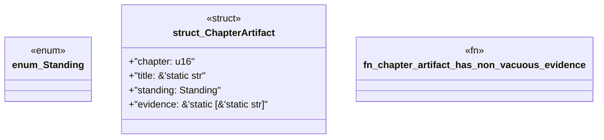

# `book/src/listings/167-167-module-wiring-collisions.rs`

Source SHA-256: `1043961d2a4ee9576d48f7f22064e7190db60b05fb868219195eeda5f0772555`

## Dependencies

- None observed.

## Standing

- Structural parse: `ALIVE`
- Runtime behavior: `UNKNOWN`
