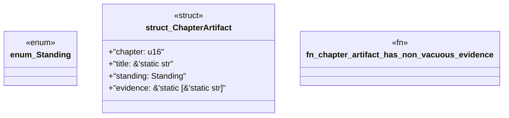

# `book/src/listings/168-168-single-writer-aggregation.rs`

Source SHA-256: `1751b08d11fe05fb3ea8fc966bf460c1ea340b7a915d1cf9eae731bea7abd07e`

## Dependencies

- None observed.

## Standing

- Structural parse: `ALIVE`
- Runtime behavior: `UNKNOWN`
