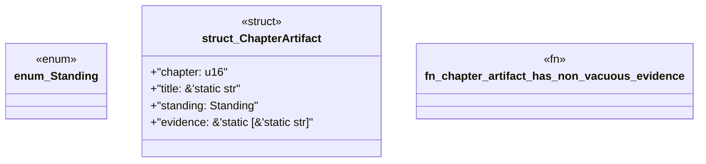

# `book/src/listings/169-169-combined-consumer-tests.rs`

Source SHA-256: `f27c10332abf02be8ce377c00bceea78bd9e6c9ba8be54fb54149c303222ffce`

## Dependencies

- None observed.

## Standing

- Structural parse: `ALIVE`
- Runtime behavior: `UNKNOWN`
