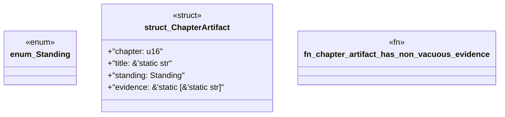

# `book/src/listings/172-172-proving-safe-union.rs`

Source SHA-256: `33220f313ad1dc22d0089c80043d2d8fd40d5b2be73aa3c5b0fb8a65c2b6c49b`

## Dependencies

- None observed.

## Standing

- Structural parse: `ALIVE`
- Runtime behavior: `UNKNOWN`
