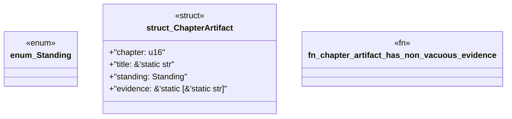

# `book/src/listings/202-202-fail-closed-pack-admission.rs`

Source SHA-256: `3e98bdf6afd70e61f76bee4176b28992dc607c2bfd2fce5cf2400a25c83c31cc`

## Dependencies

- None observed.

## Standing

- Structural parse: `ALIVE`
- Runtime behavior: `UNKNOWN`
