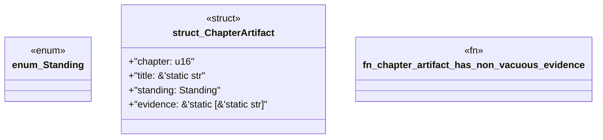

# `book/src/listings/203-203-engine-generated-module-aggregation.rs`

Source SHA-256: `68bee17275e338eb8dda743aa215e4f50d002319ece403ef7c76cd583d6e6f78`

## Dependencies

- None observed.

## Standing

- Structural parse: `ALIVE`
- Runtime behavior: `UNKNOWN`
