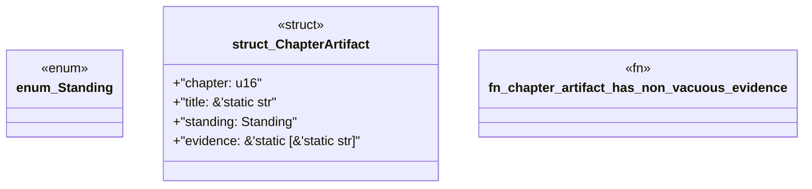

# `book/src/listings/206-206-generated-output-ownership.rs`

Source SHA-256: `41646e513160bd2162f4901068ba08cbf7481d440bc69a1b6311cb4adb709b8c`

## Dependencies

- None observed.

## Standing

- Structural parse: `ALIVE`
- Runtime behavior: `UNKNOWN`
